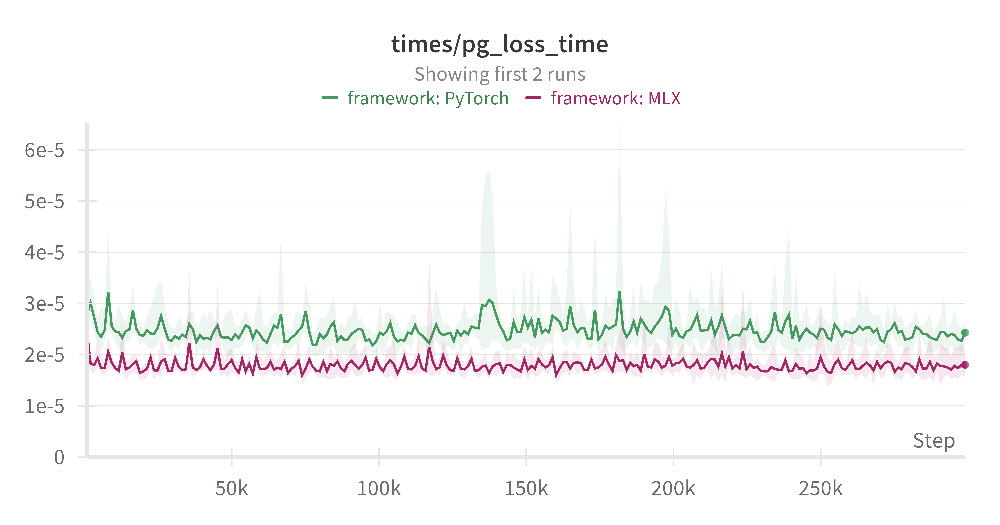

# clean-rl-mlx
Clean RL implementation of PPO using MLX


I've also included a modified version of PPO with PyTorch that should more closely match MLX, removing some of the functionality that is not yet in MLX (gradient clipping).

Set up your mlx environment with
```
pip install -r mlx-requirements.txt
```
and run on `CartPole` with:
```
python clean_rl_ppo_mlx.py
```
or set up a baseline PyTorch environment with
```
pip install -r pytorch-requirements.txt
```
and run on `CartPole` with
```
python clean_rl_ppo_pytorch.py
```

Results look close across 5 random seeds on `CartPole-v1`. Both runs will push to W & B and share plots.

Below is a short comparison of the two frameworks for CartPole.


### Performance

Performance looks close enough between the two to be the same.


    
### Timings for different calculations

Generally speaking, MLX is a tad faster than PyTorch. 
Curiously, the weight update time seems to be faster on PyTorch, but I'm not _entirely_ certain of how/where MLX is doing the updates, so my timing might be in the wrong spot.
These differences are also all quite negligible (though of course, this is just CartPole and a small network).





I wonder if step time is affected by switching devices for the vectorized environments?


### Losses

Losses generally look very similar, so I have some confidence that the implementation is not bugged.


